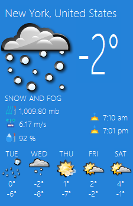
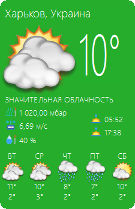
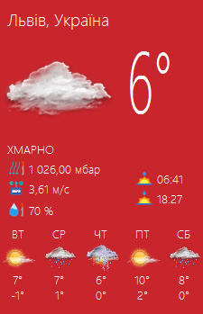
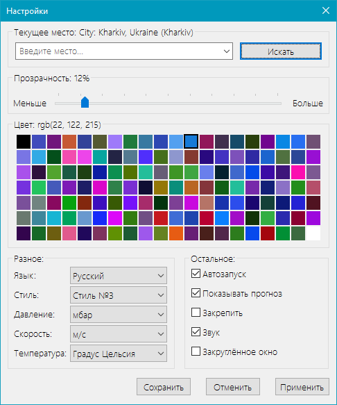

## Погодное приложение iweather для Windows

- Релиз стабильной версии приложения: [скачать](https://goo.gl/4w8MfZ).

На данный момент приложение, по умолчанию, использует погодные данные провайдера [Accuweather](http://www.accuweather.com). Реализация с [Yahoo](https://www.yahoo.com/news/weather/) не используется из-за нестабильности получения данных от провайдера.

#### Главное окно

Примеры отображения главного окна приложения:

				

Главное окно приложения настраиваемое. Можно выбрать его прозрачность, цвет, использование закругления краёв, стиль иконок, язык интерфейса, а также есть возможность скрыть часть окна с прогнозом погоды.

#### Нотификация

Приложение каждые 20 минут запрашивает данные с сервера провайдера и оповещает о текущем состоянии погоды в виде системного нотификационного сообщения (пример для Windows 10):

При наведении курсора мыши на иконку приложения, находящуюся в системном лотке, можно просмотреть текущее состояние погоды:

При щелчке на иконке приложения, в системном лотке, главное окно приложения отобразится поверх всех окон. При двойном щелчке главное окно прячется в системный лоток или разворачивается из него.

#### Окно настроек

Окно настроек выглядит следующим образом:

- В разделе "Текущее место" можно выбрать желаемое расположение (обычно название города). Данные необходимо вводить латиницей, т.к. API провайдера Accuweather, на стороне сервера, другие символы не распознаёт.

- Раздел "Прозрачность" даёт возможность настроить прозрачность главного окна приложения на своё усмотрение.

- В разделе "Цвет" можно выбрать цвет главного окна приложения.

- В разделе "Разное", как видно, можно выбрать язык интерфейса, стиль иконок,  единицы измерения таких величин как атмосферное давление, скорость ветра и температура воздуха.

- В разделе "Разное" есть возможность включить опции отвечающие за автозапуск приложения после загрузки Windows, показ/скрытие части окна с прогнозом погоды, закрепление главного окна приложения, нотификационные сообщения со звуковым сигналом (для Windows 10), отображение углов окна закруглёнными.

_ _ _

Другое:

[Использование API доступа к погодным данным](/core_test/README.md)
